# SliceGAN with Vision Transformer discriminators and a SAM front-end

Vision Transformers — FIUBA.

Professors: Esp. Abraham Rodriguez and Mg. Oksana Bokhonok

Author: Braian A. Desía (individual work).

## 1. Project goal

Three-dimensional microstructures are needed to compute effective material properties (for example as
representative volume elements for finite-element analysis), but 3D imaging (micro-CT, FIB-SEM) is
expensive and often unavailable, while 2D micrographs are cheap, fast and usually of higher resolution.
This project generates 3D two-phase microstructures from a single 2D micrograph with SliceGAN (Kench & Cooper, 2021) and studies
whether Vision Transformers improve it, either as the adversarial critic or as a segmentation front-end.

### 1.1 Background: SliceGAN

**The problem.** A 2D micrograph of a material contains, statistically, much of the information of its 3D
structure: for an isotropic material (no preferred direction), every planar cut through the volume has
the same statistics (phase fractions, feature sizes and shapes, spatial correlations) as any other. The
task is therefore to produce 3D volumes whose 2D sections are indistinguishable, statistically, from the
micrograph. Classical reconstruction methods optimize a 3D volume to match chosen statistical
descriptors (e.g. the two-point correlation), and they are slow (hours for 10⁶ voxels) and only reproduce the
descriptors they were told to match.

**Generative adversarial networks.** A GAN trains two networks against each other: a *generator* G that
maps random noise to samples, and a *discriminator* (critic) D that tries to tell generated samples from
real ones. G is updated to fool D. At equilibrium the generated distribution matches the real one. GANs
learn the statistics directly from the data instead of from hand-picked descriptors, and once trained
they generate new samples in seconds.

**SliceGAN's key idea: dimensionality expansion through slicing** (Kench & Cooper, 2021). A GAN normally
needs training data of the same dimensionality as its output, but no 3D training data exists here.
SliceGAN combines a **3D generator** with a **2D discriminator** and bridges them with a slicing step:

1. G maps a latent tensor z (Gaussian noise of shape 32 × 4 × 4 × 4 in this project) to a 64³ volume
   with one channel per phase (softmax, i.e. a soft one-hot encoding).
2. The generated volume is cut into all 64 slices along each of the three axes (3 × 64 = 192 slices).
3. D, a 2D convolutional network, scores each slice and an equal-sized random crop of the real
   micrograph. For an isotropic material one D serves all three directions.
4. The losses of all slices are combined, and both networks are updated. Because every slice of the
   volume must look like the micrograph, G learns a 3D structure whose sections in x, y and z all match
   the 2D statistics.

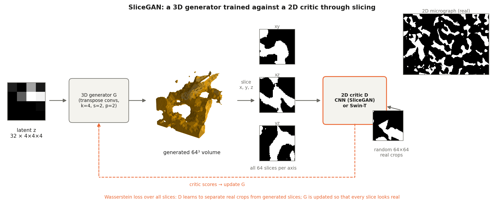

Training in the original version uses the Wasserstein loss with gradient penalty (WGAN-GP; Gulrajani et
al., 2017), in which D is an unbounded *critic* estimating the Wasserstein distance between real and
generated slices, with 5 critic updates per generator update. Using a WGAN means that this distance is only
valid if the critic is a 1-Lipschitz function (gradient norm with respect to the input ≤ 1). Instead of
clipping the weights as the original WGAN does, the GP enforces the constraint softly: a random
interpolation between a real slice x and a generated one x̃, x_ε = εx + (1−ε)x̃ with ε ~ U[0, 1], is
taken, and the term λ(‖∇D(x_ε)‖₂ − 1)², with λ = 10, is added to the critic loss. The discriminator sees all
64 slices per direction of every generated volume and uses a generator batch twice the critic batch
(m_G = 2 m_D), which the authors found most efficient.

**Generator design: uniform information density.** Early SliceGAN versions produced worse quality near
volume edges. The cause is transpose convolution: a voxel near the edge of the output receives
contributions from fewer kernel positions than a central voxel, so information is unevenly distributed.
For microstructures, where edges matter as much as the centre, the authors derive rules for the kernel
size k, stride s and padding p (s < k, k mod s = 0, p ≥ k − s) and use {k, s, p} = {4, 2, 2}. They also
give the latent z a spatial size of 4 instead of 1, so that the first layer already learns overlapping
kernel outputs. As a consequence, volumes larger than 64³ can be generated after training by simply
enlarging z. The critic, in turn, is a plain 2D CNN of five strided convolutions (64 × 64 slice → one score).

**Scope and limits.** SliceGAN reproduces the micrograph's statistics without hand-picked descriptors,
trains in a few hours on one GPU and generates volumes in seconds. It was validated against real 3D
data of a battery electrode and later applied to 87 materials in the MicroLib library (Kench et al.,
2022). In this work it is restricted to isotropic cases (anisotropic materials need two or three perpendicular
micrographs and separate critics) and a field of view that is representative of the material.

### 1.2 Background: Swin-T and SAM, and where they enter the pipeline

**Swin Transformer (Swin-T; Liu et al., 2021)** is a hierarchical Vision Transformer:

- the image is split into 4 × 4 patches, each embedded as a token;
- self-attention is computed inside local 7 × 7-token windows, which shift between consecutive layers so
  information also flows across windows;
- four stages merge patches between them, giving feature maps at decreasing resolution (like a CNN);
- position is encoded by a relative-position bias inside each window, not by absolute embeddings, so the
  network also runs on small 64 × 64 slices;
- Swin-T has 28 M parameters and is pretrained on ImageNet-1k.

In this project Swin-T replaces (M2, M3) or complements (M4, M5) SliceGAN's CNN as the 2D critic, bringing
pretrained features and attention over the whole slice. Transformer critics are known to destabilize GAN
training (ViTGAN; Lee et al., 2022), which turned out to be the central difficulty (Section 5.2).

**Segment Anything (SAM; Kirillov et al., 2023)** is a promptable segmentation model: a ViT image encoder,
a prompt encoder (points, boxes) and a light mask decoder, trained on 1 billion masks. In automatic mode a
grid of point prompts yields a mask for every object, zero-shot.

**How SAM is included.** SliceGAN needs a segmented micrograph (one label per phase) as training data.
The baseline approach obtains it with a global gray-level threshold computed with Otsu's method. This works
well for two-phase cases, and it can be extended to multi-phase ones. In this work, SAM is used as an
alternative front-end for this segmentation step, and the rest of the pipeline is unchanged:

1. SAM ViT-B (`facebook/sam-vit-base`, no fine-tuning) runs on overlapping 256 px tiles of the micrograph
   with a 32 × 32 point grid per tile (a single pass over the whole image misses most small islands);
2. masks that overlap (IoU > 0.3) are merged;
3. each merged group is labelled inclusion or matrix by its mean gray level (a two-class split of the
   group means; uncovered pixels are matrix);
4. the resulting phase map replaces the Otsu map as the training image of model M3.

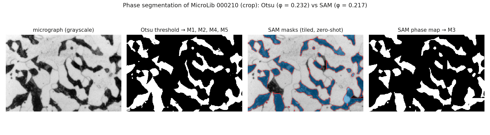

### 1.3 Project questions

- **RQ1 — ViT critic.** Does replacing SliceGAN's CNN discriminator by a Swin Transformer (Swin-T)
  improve the generated microstructures? (M1 vs M2, with an M1 + DiffAug ablation)
- **RQ2 — SAM front-end.** Does segmenting the micrograph with SAM, instead of a global threshold,
  improve them? (M2 vs M3)
- **RQ3 — ViT as an additional critic.** Does adding a pretrained Swin-T critic next to
  SliceGAN's CNN, as in Vision-aided GAN (Kumari et al., 2022), help, either from scratch (M4) or as a
  fine-tuning stage of a trained SliceGAN (M5, compared against M1 trained for the same extra steps)?

Quality is measured with the statistical descriptors used in the microstructure-generation literature
(phase fraction, two-point correlation, lineal path), since no 3D ground truth exists.

## 2. Overall architecture

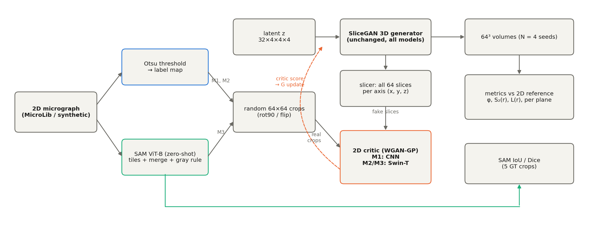

**Data.** In the isotropic case the training set is a single 2D micrograph, and the same image serves as
the reference for the three planes (xy, xz, yz). For anisotropic materials up to three images can be given,
one per orthogonal plane, and each direction has its own critic.

In this work, the main case is MicroLib entry `000210` (DoITPoMS micrograph library): an optical
micrograph of dark islands in a light matrix, 437 × 800 px after removing the scale bar, 0.687 µm/px. It
was chosen at random among the MicroLib two-phase entries with a phase gray-level gap ≥ 80 and accepted
after an isotropy check (x/y correlation-length ratio 1.11).

The second case study is a synthetic micrograph (non-overlapping discs, φ = 0.25, rendered with blur and
noise, exact ground-truth mask). Unlike the previous case, the exact phase mask is known, so both the
segmentation (Otsu or SAM) and the reference descriptors (φ, S₂) are measured without annotation error.

**Segmentation (front-end).** M1, M2, M4 and M5 train on an Otsu label map (φ = 0.232). M3 trains on a
SAM label map: zero-shot SAM ViT-B on 256 px tiles, overlapping masks merged (IoU > 0.3), and groups
whose mean gray level departs from the matrix labelled as inclusions (φ = 0.217).

**Generator.** SliceGAN's 3D resize-convolution generator, unchanged for every model (40.1 M
parameters): a 32 × 4 × 4 × 4 Gaussian latent → 64³ volume, softmax over the two phases.

**Slicer and critics.** Each generated volume is cut into all 64 slices along x, y and z. The slices
and real 64 × 64 crops of the training image are scored by a 2D critic:

| Model | Training image | 2D critic | Loss | Trainable critic params |
|-------|----------------|-----------|------|-------------------------|
| M1 | Otsu | SliceGAN CNN (5 strided convs) | WGAN-GP | 2.8 M |
| M2 | Otsu | Swin-T (ImageNet), stages 3–4 + head trainable, DiffAug, lr 2e-5 | WGAN-GP | 26.3 M |
| M3 | SAM | same critic as M2 | same as M2 | same as M2 |
| M4 | Otsu | SliceGAN CNN **+** frozen Swin-T with per-scale heads (ensemble) | CNN: WGAN-GP, Swin: hinge | 2.8 M + 0.18 M |
| M5 | Otsu | as M4, generator initialised from M1's best checkpoint | as M4 | as M4 |
| M1-ext | Otsu | as M1, generator initialised from M1's best checkpoint | WGAN-GP | 2.8 M |

M4 and M5 train two critics at once, each with its own loss and optimizer; the generator loss adds both
scores with equal weight (λ = 1):

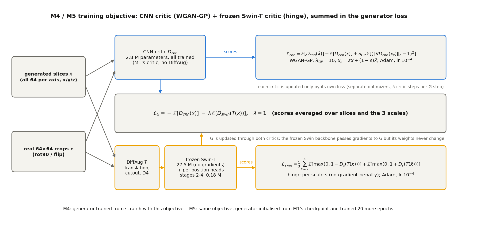

**Metrics.** For each model, 128 64³ volumes (seeds 0–127) are compared with the 2D image through φ,
S₂(r) and L(r), overall and per slice orientation, with bootstrap confidence intervals (Section 4).

## 3. Technical implementation

**Stack.** Python 3.11, PyTorch 2.5.1 (CUDA 12.4), timm 1.0.11, Hugging Face `transformers` 4.46.3,
NumPy/SciPy/scikit-image, Poetry environment (`setup.sh`), YAML configs with inheritance and dataset
overlays, logging to file and console, MLflow experiment tracking, 92 pytest tests. Trained on one NVIDIA RTX A2000 (12 GB).

**Pretrained models.**

- Swin-T: `timm/swin_tiny_patch4_window7_224.ms_in1k` on the Hugging Face Hub (the Microsoft ImageNet-1k
  checkpoint, same weights as `microsoft/swin-tiny-patch4-window7-224`). timm is used instead of
  `transformers` because Swin-T runs natively on 64 px slices only if the attention windows of stages
  3–4 shrink to 4 × 4 and 2 × 2 with a resized relative-position bias, which timm supports and
  `transformers` 4.46 does not. The RGB patch embedding is converted to two phase channels so that a
  one-hot slice is seen as a centred gray image (matrix −0.5, inclusion +0.5).
- SAM: `facebook/sam-vit-base` through the `transformers` mask-generation pipeline, zero-shot.

**SliceGAN integration.** The upstream repository is a git submodule (`external/SliceGAN`, MIT) and is
not modified.

- `src/models/slicegan_wrapper.py` builds the generator and CNN critic with upstream's network factory and
  the exact layer lists of `run_slicegan.py`, and reuses its gradient penalty.
- `src/models/train.py` is a fork of upstream's training loop with the same WGAN-GP schedule (Adam 1e-4,
  β = (0.9, 0.99), λ_GP = 10, 5 critic steps per generator step) and SliceGAN's batch rule: the critic
  sees all 64 slices per axis of m_D = 1 volume, the generator step uses m_G = 2 m_D volumes.
- Additions: critic branches (single critic or CNN + Swin ensemble), hinge loss, differentiable
  augmentation of critic inputs (DiffAug: translation, cutout, 90° rotations/flips), generator warm
  start, and checkpoint selection.
- Translations (up to ±8 px) and cutout positions are deliberately not
aligned to Swin-T's 4 px patch grid: the real crops are taken at arbitrary pixel offsets too, and unaligned
shifts change the content of every patch, so the critic cannot exploit where a feature falls within a patch.

**Checkpoint selection and evaluation protocol.** After every epoch (100 generator steps) the generator
produces 16 volumes from held-out seeds (1000–1015), and the epoch with the lowest S₂ MAE against the
model's own training image is kept. The kept checkpoint is then evaluated on 128 *different* seeds
(0–127), so the reported numbers are never measured on the volumes used to choose the checkpoint. The
same rule is applied to every model. The protocol was tightened twice during the project, because single
64³ volumes are small samples of the microstructure (≈ 30 islands; phase fraction varies by ±0.05 from
volume to volume): with 2 selection seeds and 4 evaluation seeds (run v5), model rankings reversed when
re-evaluated on 32 seeds, and a checkpoint picked as best on 2 seeds could be three times worse than the
last epoch on fresh seeds. Even with 16 seeds, choosing the best of 50 noisy epoch scores is optimistic
(the winner's curse: M1's selected checkpoint scored S₂ MAE 0.0016 on its selection seeds but 0.020 on
128 fresh seeds); evaluation on independent seeds removes that bias from the reported numbers.

**RVE export.** `src/models/export_rve.py` writes generated microstructures for FEM/FFT homogenization
codes (VTK `.vti`, MetaImage `.mhd/.raw`, Abaqus `.inp` voxel mesh with phase element sets and face node
sets, NumPy, TIFF, plus JSON metadata). Volumes larger than 64³ are obtained by enlarging the latent
input; periodic RVEs use SliceGAN's latent tiling with a 2-voxel crop, which we found to be the correct
period (the upstream 1-voxel crop duplicates a slice at the seam); periodicity is verified by comparing
the wrap-around face mismatch with interior slice-to-slice mismatch (ratio 1.0–2.0 vs 8–13 without
tiling).

**Main modules.**

- `src/data/make_dataset.py`: download, crop, Otsu, crops.
- `src/features/sam_segment.py`: SAM front-end.
- `src/features/descriptors.py`: φ, S₂, L.
- `src/models/discriminator_swin.py`: Swin critics.
- `src/models/train.py`.
- `src/models/generate.py`: volumes + metrics.
- `src/visualization/visualize.py`: figures, `metrics.csv`.
- `reports/viewer/`: an interactive volume viewer.
- `notebooks/00_eda.ipynb`: EDA notebook.

## 4. Evaluation

There is no 3D ground truth (no micro-CT), so generated volumes are compared statistically with the
2D training image. For an isotropic material, any planar section of the 3D microstructure has the
same statistics as the 2D micrograph, so the 2D descriptors of the training image must be matched by
the slice-averaged descriptors of the generated volume; this is the justification for the metrics
below (SliceGAN, Kench & Cooper 2021). All are implemented in `src/features/descriptors.py` and
tested in `tests/test_descriptors.py` against cases with analytic answers. Label 1 is the
inclusion/pore phase and `I(x)` its indicator function; curves are evaluated for `r = 0 … 32` px on
N = 128 generated 64³ volumes per model (different seeds; the brief requires N ≥ 4).

- **Phase fraction** `φ = ⟨I(x)⟩`, reported as mean ± std over the N volumes, together with
  `|Δφ| = |φ̄_gen − φ_train|`.
- **Two-point correlation** `S₂(r) = P[I(x) = 1, I(x + r) = 1]`, computed by FFT autocorrelation
  (each lag normalized by its number of valid pixel pairs, no periodicity assumed) and radially
  averaged over lag vectors with `round(|r|) = r`. `S₂(0) = φ` and `S₂(r) → φ²` for uncorrelated
  points. For a volume, `S₂` is averaged over all xy, xz and yz slices (192 slices for 64³).
- **Lineal path** `L(r)` (as in Micro3Diff, Lee & Yun 2024; Lyu & Ren 2024): probability that a
  straight segment of `r + 1` pixels lies entirely in the inclusion phase, averaged over both in-plane
  directions (2D) or the three axes (3D). `L(0) = φ`; unlike `S₂`, `L` is sensitive to connectivity
  along lines.
- **Errors**: MAE over `r` of the generated vs training curves (`S₂ MAE`, `L MAE`, using the mean
  curve over the N volumes), and the Micro3Diff error rate
  `err(S₂) = mean|S₂_gen − S₂_train| / mean|S₂_train|` (likewise `err(L)`).
- **3D isotropy check**: `φ`, `S₂ MAE` and `L MAE` per slice orientation (xy, xz, yz). If one plane
  diverges, the volume is not isotropic. Averaged over all slices, `φ_xy = φ_xz = φ_yz = φ` by
  construction, so the spread of the per-slice `φ` along each axis is reported too.
- **Uncertainty.** 95 % confidence intervals for `|Δφ|`, `S₂ MAE` and `L MAE` come from a bootstrap over
  the 128 volumes (2000 resamples, each recomputing the metric exactly as reported). Each model is
  compared with the baseline M1 through the bootstrap distribution of the difference; a model is called
  better or worse only if that interval excludes zero.
- **Typical quality during training (selection-free).** The per-epoch held-out scores are unbiased
  individually; only picking their minimum is optimistic. The median and interquartile range of the
  per-epoch held-out S₂ MAE over the second half of training, and the number of collapsed epochs
  (held-out φ < 0.05), summarize how good and how stable a model is without any selection.
- **Common reference.** Every model is scored against its own training image and against a reference
  shared by all models of a dataset, so that M3 (trained on the SAM map) is comparable with M2: the
  Otsu map for MicroLib (no ground truth exists) and the exact ground-truth mask for synthetic data.
- **SAM segmentation quality** (M3 front-end): IoU `= |P ∩ G| / |P ∪ G|` and Dice
  `= 2|P ∩ G| / (|P| + |G|)` of the label map `P` against the exact ground truth `G` on the synthetic
  image, and, on MicroLib, against a curated reference: the midpoint of the two phase gray levels
  annotated by the MicroLib authors (8 and 133) applied to the raw micrograph.

Reference scales: on the synthetic dataset, the Otsu segmentation vs the ground-truth mask gives
`S₂ MAE = 0.0021`. Uncorrelated random 64³ volumes with the correct `φ` of MicroLib 000210 give
`S₂ MAE = 0.042` (`err = 0.42`) and `L MAE = 0.077` (`err = 0.89`), a floor any useful model must beat.

## 5. Results and examples

### 5.1 Main results (MicroLib 000210)

Train / validation / test protocol (Section 3): each model's checkpoint is chosen among the per-epoch
best, the last epoch and the training snapshots on 128 validation seeds, then evaluated on 128 test
volumes against the common reference (Otsu map, φ = 0.232). Brackets: 95 % bootstrap intervals.
"Typical" is the selection-free median held-out S₂ MAE over the second half of training (16 seeds per
epoch, so on a different scale from the test columns).

| Model | Checkpoint | φ | \|Δφ\| | S₂ MAE | L MAE | Typical S₂ | vs M1 |
|-------|------------|---|--------|--------|-------|------------|-------|
| M1 CNN (SliceGAN) | last | 0.235 | 0.003 [0.000, 0.012] | 0.0029 [0.0008, 0.0087] | 0.0011 [0.0003, 0.0059] | **0.0051** | — |
| M1 + DiffAug | last | 0.229 | 0.003 [0.000, 0.012] | **0.0009** [0.0006, 0.0066] | 0.0014 [0.0010, 0.0059] | 0.0136 | no clear difference |
| M2 Swin + DiffAug | best | 0.239 | 0.007 [0.000, 0.017] | 0.0077 [0.0017, 0.0141] | 0.0055 [0.0010, 0.0109] | 0.0132 | no clear difference |
| M3 Swin + DiffAug, SAM map | last | 0.174 | 0.058 [0.050, 0.066] | 0.0328 [0.0281, 0.0371] | 0.0262 [0.0223, 0.0299] | 0.0143 | **worse** (all metrics) |
| M4 CNN + frozen Swin | best (= last) | **0.232** | **0.000** [0.000, 0.009] | 0.0014 [0.0006, 0.0067] | 0.0015 [0.0006, 0.0058] | 0.0096 | no clear difference |
| M5 M1 + Swin fine-tune | last | 0.243 | 0.010 [0.001, 0.020] | 0.0097 [0.0033, 0.0161] | 0.0092 [0.0038, 0.0147] | 0.0072 | worse on L |
| M1 extended | last | 0.238 | 0.006 [0.000, 0.015] | 0.0059 [0.0010, 0.0124] | 0.0059 [0.0019, 0.0114] | 0.0097 | no clear difference |

All errors are far below the random-volume floor (S₂ MAE 0.042, L MAE 0.077). The CNN-based models
(M1, M1 + DiffAug, M4) form the best group: their point estimates are the lowest and their intervals
overlap. In this run M4, the CNN + frozen-Swin ensemble, reproduces the phase fraction exactly (0.232) and
needed no checkpoint selection (its best epoch is its last); a second run (Section 5.7) does not repeat
either property. No model is significantly better than M1 with 128 test volumes; M3 is significantly worse against the Otsu reference, but that row mixes two effects. Its target is
shifted: the SAM map it was trained on has φ = 0.217, not 0.232, so 0.015 of its |Δφ| = 0.058 is the
front-end. The other 0.043 is the generator undershooting its own target (φ 0.174 vs 0.217; S₂ MAE 0.024 against
the SAM map), within the run-to-run spread of the Swin critic it shares with M2 (Section 5.7). On the synthetic
data, where the same model reproduces its own map almost exactly (|Δφ| 0.001, S₂ MAE 0.003; Section 5.6), the
whole gap to the ground truth comes from the front-end.

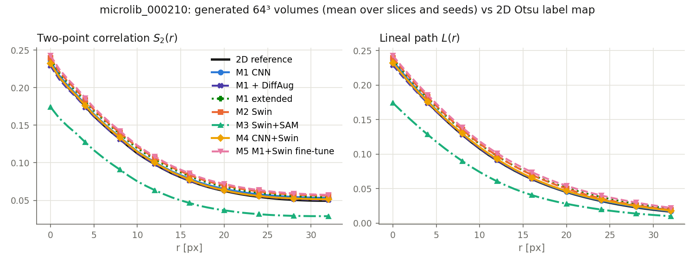

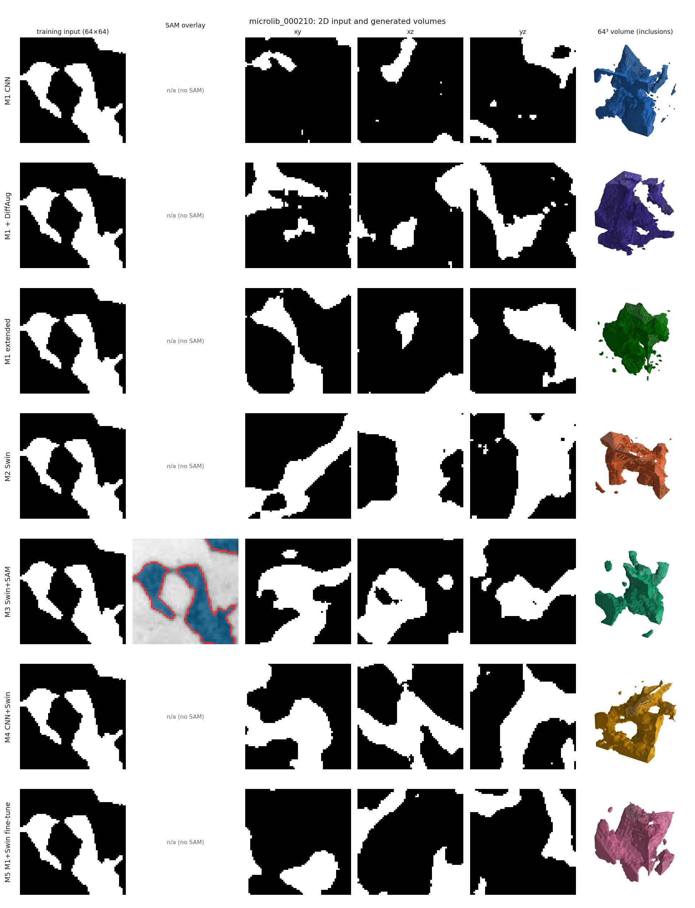

Per-model training curves: `figures/microlib_000210_training.png`; all volumes can be explored in the
interactive viewer (`reports/viewer/`).

### 5.2 Training a Swin critic: stabilization study

Transformer critics are known to make GAN training unstable (ViTGAN, Lee et al., 2022). With SliceGAN's
WGAN-GP setup the Swin-T critic was unstable in every configuration tried; the table summarizes the
first 12 epochs on MicroLib (held-out φ target 0.232; S₂ MAE of M1's best epochs: 0.002–0.004).

| Run | Swin critic | Loss | DiffAug | Epochs 1–12 | Outcome |
|-----|-------------|------|---------|-------------|---------|
| v1 | stages 3–4 trainable, lr 1e-4, last checkpoint | WGAN-GP | no | realistic at epoch 10, empty at 15 | oscillates, ended collapsed (φ = 0.003) |
| v2 | stages 3–4, lr 2e-5 | WGAN-GP | no | empty at 4–5, S₂ MAE 0.010 at 9–11 | oscillates, M1-level epochs exist |
| v2 rerun | identical settings and seed | WGAN-GP | no | good at epoch 2, then φ ≈ 0 for 10 epochs | run-to-run variability: non-deterministic GPU kernels, amplified by the GAN dynamics |
| v3 | v2 + ViTGAN: improved spectral norm, Adam β₁ = 0, G EMA | WGAN-GP | no | φ 0.002–0.08 throughout | critic too strong |
| stage-4 probe | only stage 4 trainable | WGAN-GP | no | φ 0.08–0.29, best S₂ MAE 0.037 | no full collapse, blurry |
| A | frozen, pooled multi-scale head | WGAN-GP | yes | φ = 1.0 at epochs 1–6, then 0.51 → 0.31; best S₂ MAE 0.049 | fails: gradient penalty cannot be met through a frozen backbone |
| B | stages 3–4, lr 2e-5 | WGAN-GP | yes | φ ≈ 0 at epochs 1–5; from epoch 7 φ 0.20–0.30, S₂ MAE 0.0091 / 0.018 / **0.0035** / 0.024 / 0.049 / **0.0035** | passes: M1-level epochs, more consistent than v2 |
| C | frozen, per-position multi-scale heads | WGAN-GP | yes | φ = 1.0 at epochs 1–2, 0.89–0.95 to epoch 8, then 0.38 → 0.08 → 0.11; best S₂ MAE 0.060 | fails like A: the GP, not the pooling, is the problem |
| A-hinge | frozen, pooled head, head spectral norm | hinge | yes | φ 0.57–1.0, drifting up; best S₂ MAE 0.26 | fails: no collapse, but φ uncontrolled |
| C-hinge | frozen, per-position heads, head spectral norm | hinge | yes | φ 0.31–0.56; best S₂ MAE 0.12 | fails alone; better than A-hinge, used inside M4/M5 |

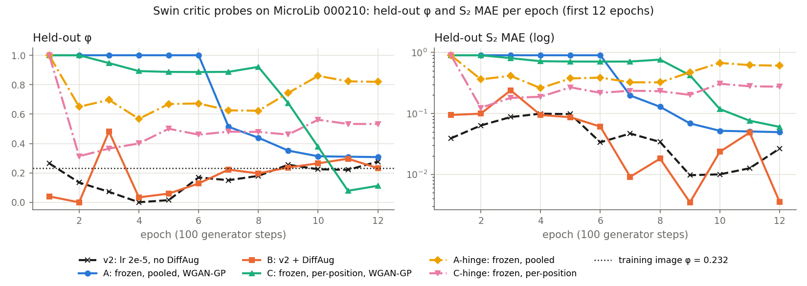

Per-epoch logs of every probe are in `reports/probes/`.

**Decision.** M2/M3 use probe B (the only Swin-only critic reaching M1-level epochs); M4/M5 use the per-position frozen heads of C-hinge inside an ensemble with the CNN critic.

Three findings shaped the final models. First, a frozen pretrained backbone cannot be trained with WGAN-GP:
the gradient penalty asks for unit input-gradient norm, which the frozen Swin layers fix and the small
head can only rescale, so the penalty dominates (values of 10–355 instead of ≈ 1) and the critic gives
no useful signal. Frozen-backbone critics in the literature (Projected GAN, Vision-aided GAN) use
hinge or BCE losses instead. Second, Vision-aided GAN reports that pretrained critics used *alone*
diverge and help only in an ensemble with the original discriminator, which motivates M4 and M5. Third, with a hinge loss the frozen Swin critic no longer collapses but does not control the phase fraction on its own (φ drifts to 0.3–0.8); a plausible cause is Swin's per-token LayerNorm, which removes much of the absolute phase-intensity information. The CNN critic in M4/M5 supplies that constraint. Finally, DiffAug is what made the trainable Swin critic work (B vs v2), in line with the limited-data GAN literature (Zhao et al., 2020; Karras et al., 2020): the critic otherwise overfits the few hundred distinct views of a single micrograph.

**Linear-probe diagnostic** (Vision-aided GAN, Sec. 3.2): a logistic regression on frozen, pooled Swin
features separates real 64 × 64 crops from slices of M1's best generator with 73 % held-out accuracy at
64 px input (stage 2 alone: 75 %), 83 % at 128 px and 83 % at 224 px; random volumes with the correct φ
are separated at 100 %. The frozen features therefore carry a usable real-vs-fake signal, strongest at
the 8 × 8 resolution of stage 2, and a larger input could add about 10 points.

### 5.3 Fine-tuning with a Swin critic (M5 vs M1-extended)

Both runs start from M1's selected checkpoint and train 20 more epochs with fresh critics; they differ
only in the critics (CNN vs CNN + frozen Swin with per-position heads). Neither improves on M1: on the
test volumes M1-extended reaches S₂ MAE 0.0059 and M5 0.0097 (M1: 0.0029), and their best per-epoch
held-out scores were reached in the first epoch, i.e. at the starting point. Once SliceGAN has converged,
adding the Swin critic as a fine-tuning stage (the Vision-aided GAN recipe) does not help here.
An earlier version of this comparison (run v5, selection on 2 seeds) suggested the opposite; that result
was selection noise and disappeared on more seeds (Section 3). On the synthetic dataset (Section 5.6) both
runs improve on M1 and M5 has the lowest S₂ MAE of all models (0.0013 vs 0.0020 for M1-extended), but the
difference between them is not significant (95 % interval of M5 − M1-extended: −0.0028 to +0.0023): the gain
comes from the extra training, not from the Swin critic.

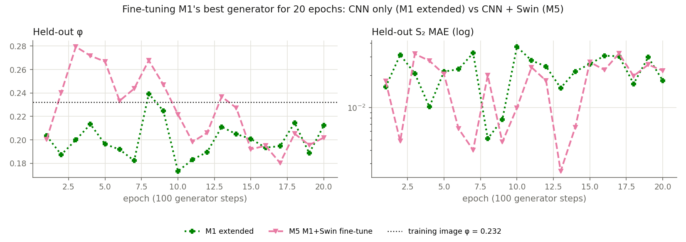

### 5.4 SAM front-end

| Dataset | φ SAM | φ Otsu | Reference (φ) | SAM IoU / Dice | Otsu IoU / Dice |
|---------|-------|--------|---------------|----------------|-----------------|
| synthetic | 0.290 | 0.254 | exact ground truth (0.250) | 0.864 / 0.927 | 0.913 / 0.955 |
| MicroLib 000210 | 0.217 | 0.232 | MicroLib-annotated threshold (0.219) | 0.845 / 0.916 | 0.941 / 0.970 |

Zero-shot SAM needs tiling on this image (a single pass with 16 points per side finds φ = 0.07), and
even tiled it has lower IoU/Dice than Otsu on both references. The EDA notebook
(`notebooks/00_eda.ipynb`) shows where the errors come from:

- **Synthetic (true ground truth):** SAM's error is a systematic one-pixel dilation. All of its wrong
  pixels lie within 2 px of a true interface and almost all are false inclusion, which adds up to φ
  overestimated by 16 %. Otsu's errors sit at the same interfaces but are balanced, so its φ is almost exact.
- **MicroLib:** the two maps agree on 96 % of the pixels. Two thirds of the disagreement is the gray
  halo around each dark particle, which Otsu (threshold 79, above the curated midpoint 70) labels as
  inclusion. The rest is a few mid-gray regions that SAM takes as whole objects. As a result SAM's φ, S₂
  and L are *closer* to the curated reference than Otsu's (S₂ MAE 0.0009 vs 0.0085). Otsu's IoU is still
  higher, because the reference is itself a global threshold and structurally favours Otsu.

The choice of front-end therefore moves the GAN's *target* by about 0.009 in S₂ MAE, more than the gap
between the best MicroLib models (0.001–0.003). This is why every model is scored against its own
training map and, separately, against a common reference (§4).

The EDA also shows that the micrograph is mildly banded along x: the correlation length is about 23 px
along x vs 19 px along y (S₂ within 5 % of its plateau). SliceGAN assumes the same statistics on all three planes, and the D4 crop
augmentation symmetrizes x and y on purpose, so the generators learn an isotropic version of the
structure. The radially averaged metrics are insensitive to this, but no model here reproduces the
banding direction.

**Label probe: an image where a global threshold fails.** Both training images above favour a global
threshold, so they cannot show what SAM adds. A third synthetic image, `synthetic_sam`
(`configs/data/synthetic_sam.yaml`), keeps the same non-overlapping discs (φ = 0.250, own layout) but adds an
illumination ramp across x larger than the phase contrast, per-phase noise that makes the two gray histograms
overlap, and a thin dark rim around each disc so every object stays locally visible. It is a label probe,
not a training set: Otsu and SAM are scored against its clean mask (`src/features/sam_probe.py`,
`reports/sam_probe.json`), and no GAN is trained on it.

| Labeling (vs clean mask, φ 0.250) | IoU | IoU dark half / bright half | φ |
|-----------------------------------|-----|-----------------------------|---|
| Otsu (global threshold) | 0.430 | 0.691 / 0.329 | 0.467 |
| SAM, global labeling rule (as used for M3) | 0.455 | 0.019 / 0.909 | 0.123 |
| SAM, local-contrast labeling | **0.931** | 0.932 / 0.930 | **0.257** |

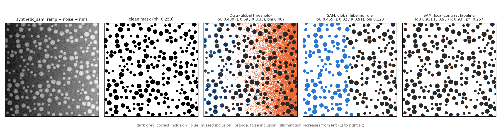

Otsu cuts across the ramp: it misses inclusions on the dark side and labels most of the bright-side matrix
as inclusion (φ 0.467). SAM's masks find every disc, but the pipeline's rule that assigns a phase to each mask
group is itself global (one split of the groups' mean gray levels), so all discs on the dark half, which are
darker than the bright-half matrix, are labelled matrix. Scoring each group against a 3 px ring just outside
it instead (`sam.classify: local`, opt-in; M3 used the global rule) cancels the ramp: IoU 0.931 and φ within
0.007 of the truth, above Otsu on the clean synthetic image (0.913). SAM's instance masks are therefore not
the weak point; the step that turns masks into phases is.

### 5.5 What do the critics look at?

SmoothGrad saliency (Smilkov et al., 2017): the gradient of each trained critic's score with respect to
its one-hot input, averaged over 16 noisy copies, on 32 real crops and 32 generated slices
(`src/visualization/critic_saliency.py`, values in `reports/critic_saliency.json`).

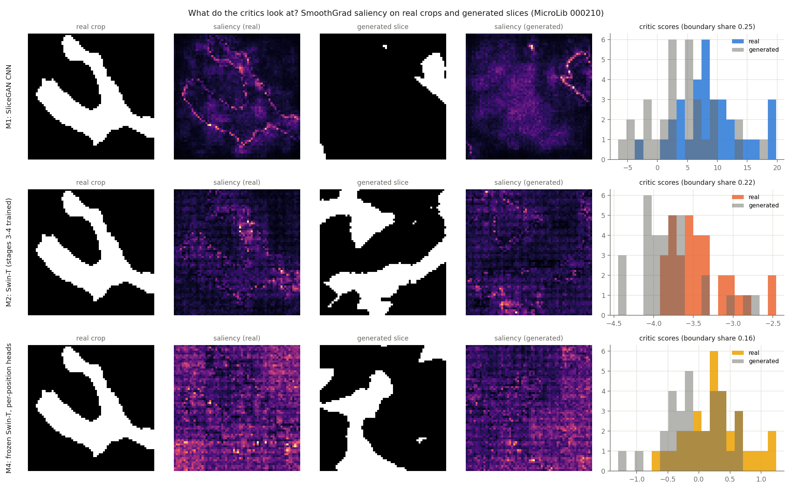

| Critic | Saliency on phase boundaries (boundary band = 12 % of pixels) | P(score real > score generated) |
|--------|---------------------------------------------------------------|---------------------------------|
| M1 SliceGAN CNN | 25 % (2.1 × its area) | 0.75 |
| M2 Swin-T, stages 3–4 trained | 22 % (1.8 ×) | 0.79 |
| M4 frozen Swin-T, per-position heads | 16 % (1.3 ×) | 0.67 |

The CNN critic concentrates on the inclusion outlines: it judges interfaces. The trained Swin-T also
favours boundaries but more diffusely, and its saliency shows the 4 × 4 patch grid of the transformer. The
frozen Swin-T heads spread their attention over the whole slice: they respond to global texture and
arrangement rather than to local edges, and separate real from generated slices least on their own. The
two critics of M4 therefore use complementary cues (CNN: interfaces; frozen Swin: global texture), a
plausible reason why the ensemble trains reliably, while the frozen Swin alone cannot control the phase
fraction (Section 5.2).

### 5.6 Synthetic dataset: comparison against a true ground truth

All seven models were retrained on the synthetic micrograph with the same configurations and protocol.
Here the common reference is the exact ground-truth mask (φ = 0.250), so the scores measure how close each
model gets to the *true* structure, including the error of its segmentation front-end. For scale, the Otsu
map itself scores S₂ MAE 0.0021 against this mask.

| Model | Checkpoint | φ | \|Δφ\| | S₂ MAE | L MAE | Typical S₂ | vs M1 |
|-------|------------|---|--------|--------|-------|------------|-------|
| M1 CNN (SliceGAN) | snapshot ep. 30 | 0.240 | 0.010 [0.003, 0.017] | 0.0040 [0.0023, 0.0080] | 0.0052 [0.0042, 0.0066] | 0.0084 | — |
| M1 + DiffAug | snapshot ep. 20 | 0.240 | 0.010 [0.004, 0.017] | 0.0045 [0.0028, 0.0080] | 0.0056 [0.0043, 0.0072] | 0.0074 | no clear difference |
| M2 Swin + DiffAug | best (ep. 29) | 0.246 | 0.004 [0.000, 0.013] | 0.0093 [0.0075, 0.0140] | 0.0216 [0.0189, 0.0260] | 0.0150 | **worse** (S₂, L) |
| M3 Swin + DiffAug, SAM map | best (ep. 15) | 0.289 | 0.039 [0.032, 0.045] | 0.0298 [0.0252, 0.0344] | 0.0317 [0.0282, 0.0350] | 0.0106 | **worse** (all metrics) |
| M4 CNN + frozen Swin | snapshot ep. 35 | 0.253 | 0.002 [0.000, 0.008] | 0.0039 [0.0026, 0.0075] | 0.0052 [0.0046, 0.0067] | **0.0032** | no clear difference |
| M5 M1 + Swin fine-tune | best (ep. 8 of 20) | 0.248 | 0.002 [0.000, 0.008] | **0.0013** [0.0008, 0.0046] | 0.0053 [0.0049, 0.0061] | 0.0050 | no clear difference |
| M1 extended | best (ep. 8 of 20) | 0.249 | 0.002 [0.000, 0.008] | 0.0020 [0.0018, 0.0045] | 0.0056 [0.0051, 0.0065] | 0.0050 | no clear difference |

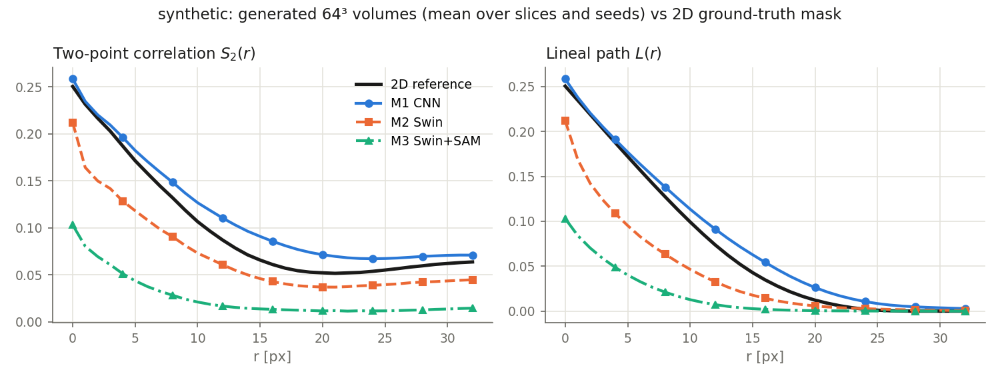

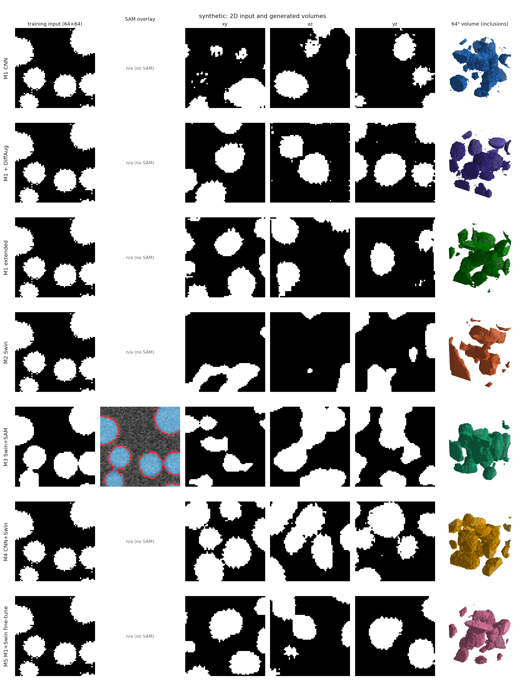

The synthetic results confirm the MicroLib conclusions (one training run per model; Section 5.7 shows how
much a second run can differ):

- **Swin as the only critic (RQ1).** M2 is significantly worse than M1 on S₂ and L, and also worse than the
  fair ablation M1 + DiffAug (S₂ difference +0.0048 [+0.0006, +0.0098], L +0.0161 [+0.0129, +0.0206]). Its
  volumes lose the disc/sphere morphology (elongated, merged inclusions in the qualitative panel). They are
  also **anisotropic**: xy slices match well (S₂ MAE 0.0054), xz and yz slices do not (0.0134 and 0.0101).
  The first MicroLib run of M2 shows the same pattern (xy 0.0027 vs xz 0.0114 and yz 0.0098), but its second
  MicroLib run is isotropic (Section 5.7), so the anisotropy is a failure mode of some Swin-critic runs, not a
  systematic property; the CNN-based models are isotropic in every run.
- **SAM front-end (RQ2).** M3 reproduces its own training map faithfully (S₂ MAE 0.0029 vs the SAM map,
  φ 0.289 vs 0.290), so the GAN works; the error comes entirely from the front-end, whose one-pixel dilation
  (Section 5.4) the generator learns as a real feature. Against the true structure M3 is the worst model and
  significantly worse than M2, its Otsu-trained counterpart, on every metric.
- **Swin as an additional critic (RQ3).** M4 is level with M1 on every metric, reproduces φ within 0.002, is
  significantly better than M2 (S₂ −0.0054 [−0.0102, −0.0015], L −0.0163 [−0.0207, −0.0134]), and was the
  most stable model during training in this run: its selection-free median held-out S₂ MAE (0.0032, interquartile range
  0.0023–0.0039) is the lowest of all seven, less than half of M1's (0.0084). As a fine-tuning stage, M5 gives
  the lowest test S₂ MAE (0.0013, below the Otsu segmentation's own 0.0021, because the generator smooths out
  the segmentation noise), but it is not distinguishable from M1-extended.

### 5.7 Repeat runs and a Swin critic at 128 px (MicroLib)

Two follow-up experiments test how robust the conclusions are. First, M1, M2 and M4 were trained a second
time with a different training seed (43 instead of 42) and otherwise identical configuration; the
validation and test seeds are the same as before. Second, M4 was trained with its Swin branch at 128 px:
slices are upsampled from 64 to 128 px before the frozen Swin-T, so its attention windows stay 7 × 7 in the
first stages, motivated by the linear probe (73 % at 64 px vs 83 % at 128 px). This run needed one generator
backward pass per slice orientation instead of one for all three (the same gradient, a third of the critic
activations in memory); otherwise it ran out of GPU memory. Values: `reports/metrics_seeds_microlib.csv`.

| Model | Run | Checkpoint | φ | \|Δφ\| | S₂ MAE | L MAE | Typical S₂ | S₂ MAE xy / xz / yz |
|-------|-----|------------|---|--------|--------|-------|------------|---------------------|
| M1 CNN | 1 | last | 0.235 | 0.003 [0.000, 0.012] | 0.0029 [0.0008, 0.0088] | 0.0011 [0.0003, 0.0059] | 0.0051 | 0.0047 / 0.0008 / 0.0040 |
| M1 CNN | 2 | snapshot ep. 35 | 0.220 | 0.012 [0.003, 0.020] | 0.0055 [0.0012, 0.0112] | 0.0045 [0.0015, 0.0093] | 0.0127 | 0.0074 / 0.0048 / 0.0042 |
| M2 Swin + DiffAug | 1 | best | 0.239 | 0.007 [0.000, 0.017] | 0.0077 [0.0019, 0.0140] | 0.0055 [0.0009, 0.0108] | 0.0132 | 0.0027 / 0.0114 / 0.0098 |
| M2 Swin + DiffAug | 2 | last | 0.229 | 0.003 [0.000, 0.012] | 0.0017 [0.0007, 0.0072] | 0.0010 [0.0004, 0.0060] | 0.0067 | 0.0051 / 0.0043 / 0.0049 |
| M4 CNN + frozen Swin | 1 | best (= last) | 0.232 | 0.000 [0.000, 0.009] | 0.0014 [0.0006, 0.0068] | 0.0015 [0.0006, 0.0059] | 0.0096 | 0.0019 / 0.0075 / 0.0014 |
| M4 CNN + frozen Swin | 2 | snapshot ep. 35 | 0.222 | 0.010 [0.002, 0.018] | 0.0044 [0.0015, 0.0096] | 0.0043 [0.0012, 0.0087] | 0.0104 | 0.0065 / 0.0027 / 0.0060 |
| M4, Swin at 128 px | 1 | snapshot ep. 40 | 0.240 | 0.008 [0.000, 0.016] | 0.0042 [0.0013, 0.0100] | 0.0022 [0.0007, 0.0070] | 0.0084 | 0.0065 / 0.0014 / 0.0056 |

- **Run-to-run variability is as large as the differences between models.** For each model the two runs
  are not significantly different, but their point estimates differ by factors of 2–4 (M2: S₂ MAE 0.0077 vs
  0.0017). The ranking of M1, M2 and M4 changes between the first and the second set of runs, and within
  the second set no pair is significantly different. On MicroLib, the three critics therefore reach the same
  quality; a ranking from a single run per model would not be reliable.
- **Properties that did not repeat.** M4's exact φ and "best epoch = last", and M2's anisotropy, were
  features of single runs. M4's selection-free typical score is the most reproducible between runs
  (0.0096 and 0.0104, vs 0.0051 and 0.0127 for M1), which is weak evidence for a more predictable
  training, not for a better one.
- **Swin at 128 px.** No clear difference from M4 at 64 px (S₂ difference +0.0018 [−0.0037, +0.0086]), M1 or
  M2. Its selected checkpoint scored 0.0010 on the validation seeds but 0.0042 on the test seeds, and its
  late epochs oscillate (last epoch 0.027). The better real-vs-generated separation of the frozen features
  at 128 px did not translate into better volumes, so the synthetic repeat of this variant was not run.

### 5.8 Model size and computational cost

Measured on the RTX A2000 (12 GB) used for every run (`src/visualization/compute_cost.py`,
`reports/compute_cost.json`). FLOPs count 2 per multiply-add on one input; the training estimate per generator
step follows SliceGAN's schedule (the critic sees 1464 slices and the generator 7 volumes per step, forward plus
backward ≈ 3× forward; gradient penalty and DiffAug not included).

| Component | Parameters (trainable) | GFLOPs per forward pass | Used for |
|-----------|------------------------|-------------------------|----------|
| 3D generator (all models) | 40.1 M | 27.1 per 64³ volume (145 per 128³) | training and inference |
| SliceGAN CNN critic | 2.76 M | 0.21 per 64 × 64 slice | training (M1, M4, M5) |
| Swin-T critic, stages 3–4 trained | 27.5 M (26.3 M) | 0.85 per slice | training (M2, M3) |
| Frozen Swin-T + per-position heads | 27.7 M (0.18 M) | 0.85 per slice (4.1 at 128 px) | training (M4, M5) |
| SAM ViT-B (front-end) | 93.7 M (none trained) | — | M3 data preparation, once |

| Model | Estimated TFLOPs per generator step | Measured s per generator step | Training time (MicroLib) |
|-------|------------------------------------|-------------------------------|--------------------------|
| M1 CNN | 1.5 | 0.31 | 27 min |
| M1 + DiffAug | 1.5 | 0.40 | 36 min |
| M2 / M3 Swin critic | 4.3 | 1.93 | 163 / 162 min |
| M4 CNN + frozen Swin | 5.2 | 1.16 | 98 min |
| M4, Swin at 128 px | 19.5 | 3.61 | 303 min |
| M5 / M1-extended (20 epochs from M1) | 5.2 / 1.5 | 1.16 / 0.31 | 40 / 11 min (+ M1) |

- **Inference costs the same for every model.** The critics are only needed for training; all models share the
  same 40.1 M-parameter generator, which produces a 64³ volume in
  14 ms on the GPU (0.25 s on CPU) and a 128³ volume in
  67 ms. Vision Transformer critics therefore add no deployment cost.
- **Training cost is set by the critic.** A Swin-T slice costs about 4× the FLOPs of a CNN slice, and the critic
  is evaluated on about 1500 slices per generator step, so the critic dominates training. M2 / M3 take 6× longer
  than M1, more than the FLOP ratio (2.9×), because gradients flow through 26 M critic weights and the gradient
  penalty's double backward passes through attention. M4 does more FLOPs than M2 but trains faster (3.7× M1):
  its Swin backbone is frozen (no weight gradients) and its Swin branch uses a hinge loss without a gradient
  penalty. Moving the Swin to 128 px multiplies its FLOPs by 4.8 and its training time by 3, for no gain
  (Section 5.7); it also needed one generator backward pass per slice orientation to fit in 12 GB.
- **SAM is a one-off cost.** Segmenting the MicroLib image takes about 35 s
  (93.7 M parameters, 256 px tiles), negligible next to training, and SAM is not used at generation time.
- **Cost against benefit.** Since no Swin variant beats the CNN critic (Sections 5.1, 5.6, 5.7), SliceGAN's
  2.8 M-parameter critic is also the best choice per GPU-hour. The final runs of this report took
  28 GPU-hours in total; the exploratory runs (v1–v5, probes) are not included.

## 6. Conclusions and future work

**Answers to the project questions** (two datasets, 128 test volumes per model, bootstrap intervals; two
training runs of M1, M2 and M4 on MicroLib):

- **RQ1 — Swin-T instead of the CNN critic: no gain in the regime tested.** The conclusion is about this use of
  Swin-T, not about ViT critics in general: the backbone is pretrained on 224 px images with 7 × 7 windows, and
  here it sees 64 px slices, so its last stages shrink to 4 × 4 and 2 × 2 windows, and only those stages are
  trained. The linear probe already shows the frozen features separate real from generated slices better at
  128 px (83 %) than at 64 px (73 %); the single 128 px run (Section 5.7, frozen backbone in M4) did not turn that
  into better volumes, and a trainable Swin critic at 128–224 px was not tested. Trained in SliceGAN's WGAN-GP setup, a Swin-T critic was
  unstable in every configuration until DiffAug was added. With DiffAug it reaches the CNN's quality but not
  more: on MicroLib its two runs bracket the CNN's (no significant difference in either), and the single
  synthetic run is significantly worse on S₂ and L (also against the M1 + DiffAug ablation) and less isotropic,
  a failure mode of some runs rather than a property of the critic (the second MicroLib run is isotropic).
  Standard ViT-GAN stabilizers (lower learning rate, improved spectral norm, Adam β₁ = 0,
  generator EMA, a smaller trainable part) did not remove the instability; a frozen Swin critic cannot be
  trained with WGAN-GP at all (the gradient penalty dominates) and, with a hinge loss, does not control φ.
- **RQ2 — SAM instead of a global threshold: no, for this kind of image.** On high-contrast two-phase
  micrographs zero-shot SAM is a worse segmentation than Otsu against a true ground truth (a systematic
  one-pixel dilation, φ +16 %). The GAN reproduces SAM's map faithfully, so M3 inherits this bias and is
  significantly worse than M2 on both datasets. The front-end shifts the GAN's target more than any change
  of critic does: segmentation quality matters more than the critic architecture. A label probe where a
  global threshold fails (an illumination ramp, Section 5.4) shows the other side: SAM's masks still find
  every particle, and with a local-contrast labeling rule SAM reaches IoU 0.93 against 0.43 for Otsu. In this
  pipeline the weakness of zero-shot SAM is the step that assigns phases to its masks, not the masks.
- **RQ3 — Swin-T as an additional critic: it matches the baseline, with no measurable gain.** The CNN +
  frozen-Swin ensemble (M4, Vision-aided GAN style) is statistically level with SliceGAN in all three
  comparisons (two MicroLib runs, one synthetic), is significantly better than the Swin-only critic on
  synthetic data, and its training quality is the most reproducible between runs. Its first run looked
  better (exact φ, best epoch = last, lowest typical score on synthetic), but the second MicroLib run did not
  repeat that. Saliency maps show that the two critics use complementary cues: the CNN judges interfaces,
  the frozen Swin global texture. Moving the Swin branch to 128 px did not help. Used as a fine-tuning stage of a converged
  SliceGAN (M5), the Swin critic gives no gain over training the CNN alone for the same extra steps.

**Overall.** SliceGAN's small CNN critic is hard to beat on two-phase 64³ microstructures. A Swin-T critic used
on 64 px slices, far from its 224 px pretraining regime, alone (with DiffAug) or next to the CNN, reaches the
same quality but not better; used alone it is harder to
train and sometimes produces anisotropic volumes, while next to the CNN (a 0.18 M-parameter head on a frozen
backbone) it trains as reliably as the baseline. The second lesson is methodological and probably the most
transferable: single 64³ volumes are noisy samples (φ ±0.05), the same model trained twice can differ by a
factor of 2–4, and model rankings obtained with a few seeds or a single run reversed when re-evaluated.
Separate selection, validation and test seeds, bootstrap intervals and repeat runs were needed to reach
conclusions that hold.

**Limitations.** Two training runs for M1, M2 and M4 on MicroLib and one for every other model and for the
synthetic dataset, while Section 5.7 shows that run-to-run variability is as large as the differences between
models; 64 px slices, which force Swin-T's windows down to 4 × 4 and 2 × 2
and use the backbone far from its 224 px pretraining resolution; one real micrograph, high contrast and
two phases, where a global threshold is already near-optimal.

SliceGAN is the literature baseline; 2024 works (Micro3Diff, Lee & Yun 2024; DDPM-GAN, Phan et al. 2024) improve descriptors and stability
with diffusion models, but are outside the scope of this work. The contribution here is a controlled evaluation of Swin critics and of SAM as a phase front-end.

**Ongoing work: local-contrast labeling on the training images.** The labeling rule that wins the probe
(Section 5.4) is being applied to the existing synthetic and MicroLib images, writing to separate folders so
the maps M3 was trained on are unchanged, and scored against the same references as Otsu and the global rule.
On MicroLib it could remove the gray halo that separates SAM's map from Otsu's; if the new maps are better,
M3 will be retrained on them. Results are not part of this report.

**Future work.** Five or more training runs per model, which the run-to-run spread requires before any
ranking; harder micrographs (low contrast, texture, three phases) where SAM's
object-level segmentation can pay off, possibly with point prompts or a fine-tuned mask decoder; and
diffusion-based generators.

## 7. Planning

| Task | Owner | Status |
|------|-------|--------|
| Repo skeleton, configs, Makefile, Poetry setup, tests, MLflow tracking | Braian Desia | Done |
| Datasets: synthetic + MicroLib 000210; EDA notebook | Braian Desia | Done |
| Descriptors φ / S₂ / L, bootstrap intervals + tests | Braian Desia | Done |
| M1 SliceGAN baseline (+ DiffAug ablation, M1-extended) | Braian Desia | Done |
| M2 Swin-T critic + stabilization study (v1–v3, probes A/B/C, hinge variants) | Braian Desia | Done |
| M3 SAM front-end | Braian Desia | Done |
| M4 / M5 Vision-aided extensions | Braian Desia | Done |
| Repeat runs (second seeds of M1, M2, M4) and Swin critic at 128 px | Braian Desia | Done |
| Evaluation protocol (train / validation / test seeds), figures, saliency | Braian Desia | Done |
| Interactive volume viewer and Streamlit explorer | Braian Desia | Done |
| RVE export for FEM / FFT codes | Braian Desia | Done |
| SAM label probe (`synthetic_sam`) and local-contrast labeling | Braian Desia | Done |
| Local-contrast labeling on the synthetic and MicroLib images (ongoing work, Section 6) | Braian Desia | In progress |
| Report (English + Spanish, PDF) | Braian Desia | Done (5 Oct) |
| Presentation, 15 min | Braian Desia | 12 Oct |

## References

- S. Kench, S. J. Cooper. Generating three-dimensional structures from a two-dimensional slice with
  generative adversarial network-based dimensionality expansion. *Nature Machine Intelligence*, 2021.
- S. Kench et al. MicroLib: A library of 3D microstructures generated from 2D micrographs using SliceGAN.
  *Scientific Data*, 2022.
- Z. Liu et al. Swin Transformer: Hierarchical Vision Transformer using Shifted Windows. *ICCV*, 2021.
- A. Kirillov et al. Segment Anything. *ICCV*, 2023.
- I. Gulrajani et al. Improved Training of Wasserstein GANs. *NeurIPS*, 2017.
- K. Lee et al. ViTGAN: Training GANs with Vision Transformers. *ICLR*, 2022.
- N. Kumari, R. Zhang, E. Shechtman, J.-Y. Zhu. Ensembling Off-the-shelf Models for GAN Training.
  *CVPR*, 2022.
- A. Sauer et al. Projected GANs Converge Faster. *NeurIPS*, 2021.
- S. Zhao et al. Differentiable Augmentation for Data-Efficient GAN Training. *NeurIPS*, 2020.
- D. Smilkov et al. SmoothGrad: removing noise by adding noise. *arXiv:1706.03825*, 2017.
- T. Karras et al. Training Generative Adversarial Networks with Limited Data. *NeurIPS*, 2020.
- K.-H. Lee, G. J. Yun. Multi-plane denoising diffusion-based dimensionality expansion for 2D-to-3D
  reconstruction of microstructures with harmonized sampling (Micro3Diff). *npj Computational
  Materials*, 2024. doi:10.1038/s41524-024-01280-z
- J. Phan, M. Sarmad, L. Ruspini, G. Kiss, F. Lindseth. Generating 3D images of material microstructures
  from a single 2D image: a denoising diffusion approach. *Scientific Reports*, 2024.
- X. Lyu, X. Ren. Microstructure reconstruction of 2D/3D random materials via diffusion-based deep
  generative models. *Scientific Reports*, 2024.
